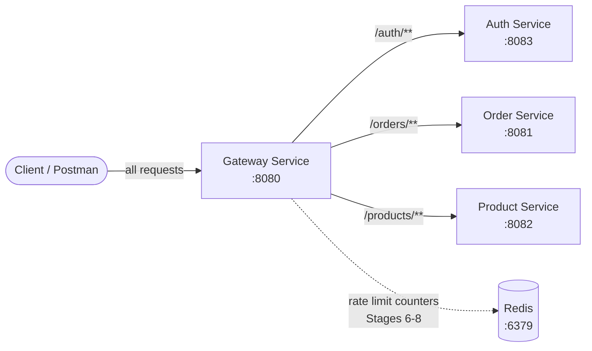
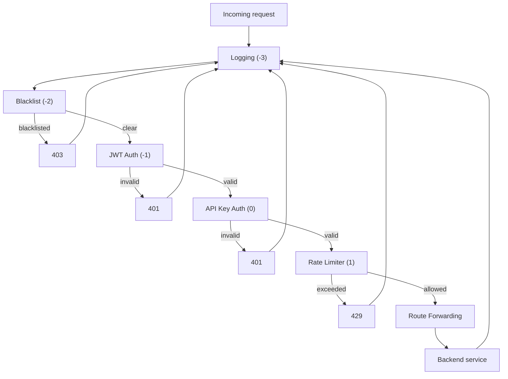

# High-Level Design: API Gateway with Custom Rate Limiter

## 1. What this is, and why it's built this way

Most tutorials teach an API gateway as "one Spring Cloud Gateway app with a
few routes." That's true, but it hides the actual reason gateways exist in
production: they're where you centralize the things every backend service
would otherwise have to reimplement — authentication, access control,
abuse prevention, and observability. This project rebuilds that reasoning
step by step, rather than starting from a finished design. Each of the 10
stages below exists because the stage before it exposed a gap.

That progression is the point. The commit history and this document both
follow the same order the system was actually built in, on purpose.

## 2. System Context



Four services, one entry point. `auth-service`, `order-service`, and
`product-service` are only meant to be reached through the gateway — ports
8081-8083 being open locally is a development convenience, not the
intended production access pattern (see §9).

## 3. How each stage came together
[README.md](README.md)
### Stage 1 — Basic Gateway

The starting question was simple: can one process sit in front of two
others and forward requests correctly? `gateway-service` was built on
Spring Cloud Gateway, which is reactive (WebFlux/Netty) rather than the
usual Spring MVC — a deliberate choice, since a gateway sits on the hot
path for every single request in the system and needs to handle many
concurrent connections without blocking threads waiting on I/O.
`order-service` and `product-service` stayed on ordinary Spring MVC, since
neither has that same constraint.

Routing itself turned out to need no custom Java code at all — Spring
Cloud Gateway matches requests against `predicates` (path patterns like
`Path=/orders/**`) declared in `application.yml`, and forwards them to the
matching route's `uri`. That declarative shape mattered later: every
stage after this one plugs in as a *filter*, layered on top of routing
that never had to change.

### Stage 2 — JWT Authentication

Once routing worked, the next gap was obvious: anyone could call any
route. Rather than bolt authentication onto the gateway itself, token
issuance was split into its own `auth-service` — a deliberate separation
of concerns. `auth-service` owns credential checking and signs JWTs;
`gateway-service` only ever *verifies* them. Both share one HMAC secret
(HS256), which is the appropriate choice here since they're part of the
same deployment unit and trust boundary — if independently-deployed
services needed to verify tokens without being trusted to issue them,
that's when you'd move to asymmetric RS256 signing instead.

The verification itself is a `GlobalFilter` — Spring Cloud Gateway's
mechanism for logic that runs on every request, before routing happens.
It checks for `Authorization: Bearer <token>`, and on success, forwards
the resolved identity downstream as plain headers (`X-Auth-Username`,
`X-Auth-Roles`) rather than passing the raw token through. That one
decision is what keeps `order-service` and `product-service` completely
free of authentication logic — they trust that if a request reached them,
the gateway already checked it.

### Stage 3 — API Key Validation

JWT answers "who is this user," but not "which client application is
calling." Those are genuinely different questions — a mobile app and a
partner integration might both act on behalf of the same logged-in user,
but you'd still want to know which one is actually making the request
(for later per-client rate limits, if nothing else). A second, independent
`GlobalFilter` checks `X-API-Key` against a small config-backed registry
mapping each key to a named client, and forwards `X-Client-Name`
downstream the same way JWT forwards username/roles. Both filters run
independently — neither one covers for the other, and a request needs
both to pass.

### Stage 4 — Request Logging

With two auth filters now capable of rejecting requests before they ever
reach a backend service, there was no way to see *what* the gateway had
actually done without reading application code. A `LoggingFilter` fixes
that — and its position in the filter order is the interesting part.
Every `GlobalFilter` has an `Ordered.getOrder()` value; lower numbers run
first on the way *in*, and — because each filter wraps `chain.filter()`
in a `.then(...)` — the same lower-numbered filters also run *last* on
the way *out*. Giving `LoggingFilter` the lowest order value of all makes
it wrap every other filter, so a request rejected by auth still produces
a matched `-->`/`<--` log pair with the real status code, not just
requests that succeeded.

### Stage 9 — Blacklist Support *(built ahead of schedule)*

Once auth and logging existed, an obvious question followed: what if a
caller's credentials are technically still valid, but you already know
they shouldn't be trusted — a leaked API key, an abusive IP? Checking
that *after* running JWT/API-key validation would mean paying the cost of
full auth checks on every request from someone you're about to reject
anyway. So `BlacklistFilter` sits *before* both auth filters in the chain
— it's a cheap lookup against two config-backed lists (blocked IPs, revoked
keys), and it returns `403 Forbidden` rather than `401 Unauthorized`,
since the distinction matters: `401` means "you haven't proven who you
are," `403` means "I know who you are, and you're explicitly denied."

### Stage 5 — In-Memory Fixed Window Rate Limiter

This is where the project's core theme starts: not just "add a rate
limiter," but understand why there are several different algorithms for
the same-sounding problem. Fixed window is the simplest one — divide time
into clock-aligned buckets (e.g. `12:00:00-12:00:59`), keep one counter 
per client per bucket, reset on rollover. The implementation is a single
`ConcurrentHashMap<String, Window>`, where each `Window` holds its own
start-timestamp and atomic counter, checked and incremented synchronously
per key.

It has a known, deliberate flaw: a client can send a full limit's worth
of requests at the very end of one window and another full limit's worth
at the very start of the next — up to 2x the intended rate in a short
real span, since the algorithm only ever asks "how many in *this*
clock-aligned bucket," never "how many in the last N seconds from now."
That flaw isn't a bug to quietly fix here — it's the reason Stage 7
exists, and it's worth being able to explain clearly rather than glossing
over.

The rate-limit key itself combines identity from both earlier stages —
`username:client`, e.g. `seema:mobile-app` — pulled from the
`X-Auth-Username` and `X-Client-Name` headers that Stages 2 and 3 already
resolved. That's only possible because this filter runs *after* both auth
filters in the chain; by the time it executes, identity is fully known.

### Stage 6 — Redis-Backed Fixed Window (distributed)

The in-memory limiter's entire state lives inside one JVM's memory. Run
two `gateway-service` instances behind a load balancer — which is the
whole point of a gateway existing, horizontal scale — and each instance
has its own separate counter. A client could get up to Nx the intended
limit just by having requests land on different instances.

The fix wasn't a new algorithm, just new storage: a `RateLimiter`
interface was introduced so the filter code never has to know which
implementation is behind it, and `@ConditionalOnProperty` on
`rate-limit.strategy` selects the active one at startup with zero code
changes — the Strategy pattern, applied concretely. The Redis version uses
`INCR` (atomic increment-or-create) on a key like
`ratelimit:seema:mobile-app:<windowStart>`, with a TTL set on first
increment so old window keys expire themselves rather than needing manual
cleanup. `INCR`'s atomicity matters specifically because multiple gateway
instances now hit the same key concurrently — a naive "read, then write"
approach would let two simultaneous requests both read the same starting
count and both think they were allowed.

Worth being upfront about one honest limitation: `INCR` and the following
`EXPIRE` are two separate Redis commands, not one atomic operation. A
crash between them could theoretically leave a key with no expiry. The
production-grade fix is a Lua script executed via `EVAL` that does both
atomically — not implemented here, but worth knowing the gap exists
rather than assuming this is bulletproof.

### Stage 7 — Sliding Window Rate Limiter

This stage exists to fix the exact flaw Stage 5 knowingly left in place.
Rather than log every individual request timestamp (accurate, but storage
grows with traffic), this uses the **sliding window counter** approach —
the same one production rate limiters like Cloudflare's actually use:
keep two adjacent fixed-window counts (current and previous), and blend
them with a weight based on how far "now" is into the current window.

```
estimated_count = (previous_window_count × weight) + current_window_count
weight = 1 - (time_elapsed_in_current_window / window_length)
```

Early in a window, the previous window's traffic still counts almost
fully (weight near 1.0); late in the window, it barely counts (weight
near 0.0), since most of the relevant traffic is now the current window's
own count. That's what smooths the hard edge: a burst spanning the
boundary between two windows gets proportionally counted against both,
instead of each window pretending the other doesn't exist.

Built directly on Redis, skipping an in-memory version — the point of an
in-memory-to-distributed progression was already demonstrated once in
Stages 5→6, and repeating it here wouldn't teach anything new. Two Redis
keys per rate-limit key now exist (`ratelimit:sliding:<key>:<windowStart>`
for current and previous), each needing a TTL of *twice* the window
length rather than once — a window's count has to remain readable as
"previous" for the entire duration of the *next* window before it's
finally irrelevant.

### Stage 8 — Token Bucket

The last of the four rate limiter variants, and the only one built on a
genuinely different model rather than a refinement of fixed window.
Fixed and sliding window are both about capping throughput as smoothly as
possible. Token bucket instead treats controlled bursting as a *feature*:
a bucket holds up to N tokens, refills continuously over time, and every
request consumes one token — rejected only if the bucket is empty. A
client that's been quiet can legitimately burst several requests at once
by spending accumulated tokens, then has to wait for the bucket to
refill — closer to how real-world APIs like Stripe or GitHub actually
behave, where short bursts are fine and only *sustained* abuse gets
throttled.

It reuses the existing `RateLimiter` interface and the same two config
values (`max-requests`, `window-seconds`) with a reinterpretation rather
than new config: `max-requests` becomes bucket capacity, and
`window-seconds` becomes "time to fully refill from empty" — so refill
rate is simply `capacity / windowMillis` tokens per millisecond. State
lives in a Redis hash per key, holding current token count and last-refill
timestamp; each check computes how many tokens have accumulated since the
last check, caps at capacity, and decrements one if a token's available.
The same read-then-write atomicity caveat as Stage 6 applies here too.

### Stage 10 — Metrics & Monitoring

By this point, the gateway makes real decisions on every request —
forward it, or reject it, and if rejecting, for which of four different
reasons. None of that was visible without reading logs line by line. A
small `GatewayMetrics` class wraps Micrometer counters (already available
transitively via `spring-boot-starter-actuator`, no new dependency
needed) — one counter for total requests, one for successfully forwarded
requests, and one *tagged* counter for rejections, split by `reason`
(`blacklist`, `jwt`, `api-key`, `rate-limit`). Each filter got one new
line at its existing rejection point, calling the matching counter — no
logic changes anywhere.

A custom Actuator endpoint (`GatewayStatsEndpoint`, exposed at
`/actuator/gatewaystats`) then reads all of those counters back out in
one readable JSON response, rather than requiring several separate
`/actuator/metrics/...` queries with tag-filter syntax. This is the same
mechanism Spring Boot's own built-in endpoints (`/actuator/health`,
`/actuator/gateway/routes`) use internally — `@Endpoint` plus
`@ReadOperation` is all that's needed for Spring to auto-register a new
one, no manual controller required.

## 4. The filter chain, in final order



Every rejection path still flows back through Logging (order `-3`, the
lowest of all), which is what makes even a `403`/`401`/`429` show up with
an accurate status code and duration in the console — and now also
increments the matching metric.

## 5. Identity propagation

| Header | Set by | Meaning |
|---|---|---|
| `X-Auth-Username` | JWT filter | Subject claim from the validated JWT |
| `X-Auth-Roles` | JWT filter | Comma-separated roles claim |
| `X-Client-Name` | API key filter | Named client the API key belongs to |

Backend services never see a raw token or API key — only these headers,
set once the gateway has already done the verification work.

## 6. Rate limiter strategy, swappable by config

```yaml
rate-limit:
  strategy: token-bucket   # memory | redis | sliding | token-bucket
  max-requests: 5
  window-seconds: 60
```

All four implementations sit behind one `RateLimiter` interface.
`@ConditionalOnProperty(name = "rate-limit.strategy", havingValue = "...")`
on each implementation means Spring wires in exactly one of them at
startup, based purely on this config value — `RateLimitingFilter` and
every other filter never change, regardless of which algorithm is active.

## 7. Security notes

- **Symmetric JWT signing (HS256):** appropriate given `auth-service` and
  `gateway-service` are part of the same deployment unit. RS256 (private
  key signs, public key verifies) would be the move if more
  independently-deployed services needed to verify tokens without being
  trusted to issue them.
- **Secrets in plaintext config:** acceptable for a local/portfolio setup;
  a real deployment would pull these from a vault or config server, never
  commit them to git.
- **401 vs 403 vs 429, kept consistent:** `401` = missing/invalid
  credentials, `403` = blacklisted (identity known, explicitly denied),
  `429` = identity known and allowed, but rate exceeded. Consistent status
  codes make client-side error handling predictable.

## 8. Known limitations, stated plainly

- Redis-backed rate limiters (Stages 6-8) all have a non-atomic
  read/increment-then-expire sequence; a crash mid-sequence could leave a
  stray key without a TTL. A Lua script via `EVAL` would close this gap.
- Sliding window here is the *counter* approximation, not the fully
  accurate *log* variant — a deliberate storage-vs-accuracy trade-off.
- No persistence/database layer anywhere in the system — all "data"
  (users, API keys, blacklist entries) is config-backed or in-memory,
  appropriate for this project's scope but a clear next extension.

## 9. Deployment consideration (not yet implemented)

All four services currently run on `localhost` with distinct ports, and
nothing stops a client from bypassing the gateway and calling
`order-service` on 8081 directly. In a real deployment, only
`gateway-service` would have a public-facing port; the other three would
sit on a private network/security group with no public ingress — making
the gateway the only reachable entry point rather than merely the
intended one.