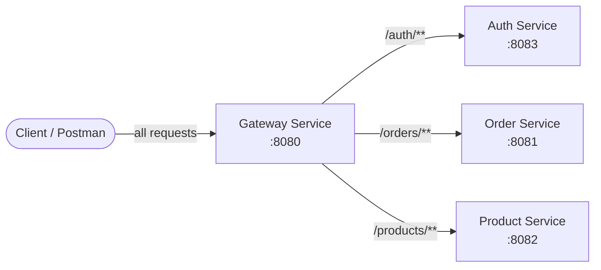
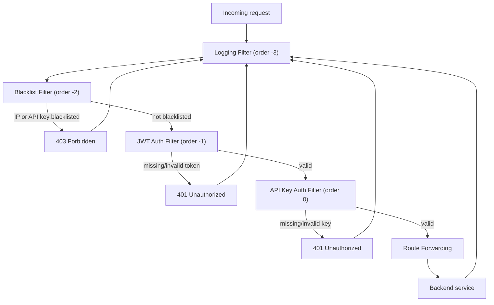
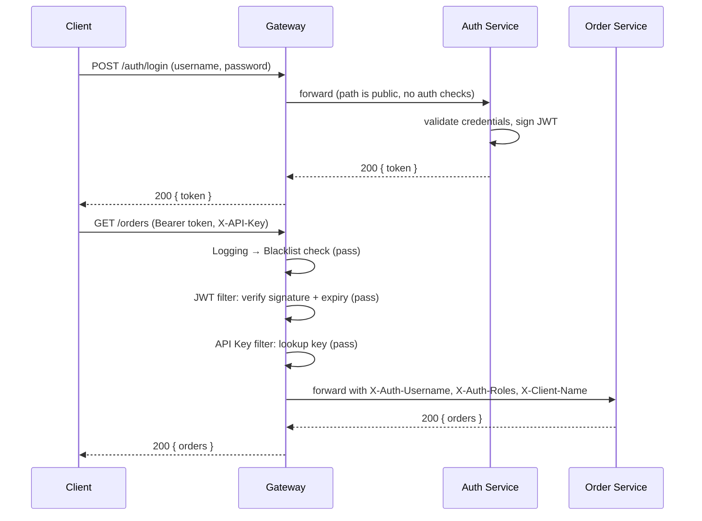

# High-Level Design: API Gateway with Custom Rate Limiter

## 1. Purpose

A single entry point in front of independently deployable backend services,
responsible for routing, authentication, access control, and (in later
stages) rate limiting and metrics — the responsibilities a real gateway
(Kong, Envoy, Spring Cloud Gateway in production use) takes on so
individual backend services don't each have to reimplement them.

## 2. Scope

**Implemented so far:**
- Basic routing to backend services
- Request/response logging
- IP and API-key blacklist enforcement
- JWT-based authentication (dedicated auth-service)
- API-key based client authentication

**Planned (not yet built):**
- Rate limiting — four algorithm stages: in-memory fixed window, Redis-backed
  fixed window (distributed), sliding window, token bucket
- Metrics & monitoring endpoint

## 3. System Context

All client traffic enters through the gateway on port 8080. No service is
called directly by a client — `auth-service`, `order-service`, and
`product-service` are only reachable through gateway routes in this design
(ports 8081-8083 being open locally is a dev-environment convenience, not
the intended production access pattern — see §7).

## 4. Component Responsibilities

| Component | Responsibility | Port | Framework |
|---|---|---|---|
| `gateway-service` | Routing, logging, blacklist, JWT/API-key auth enforcement | 8080 | Spring Cloud Gateway (WebFlux, reactive) |
| `auth-service` | Validates credentials, issues signed JWTs | 8083 | Spring Boot Web (MVC) |
| `order-service` | Owns order data/logic | 8081 | Spring Boot Web (MVC) |
| `product-service` | Owns product data/logic | 8082 | Spring Boot Web (MVC) |

`gateway-service` is deliberately the only reactive module. It sits on the
hot path for every request and needs to handle many concurrent connections
without blocking threads on I/O — the property WebFlux's Netty-based,
non-blocking model provides. The backend services behind it have no such
constraint, so they use the simpler, more familiar Spring MVC model.

## 5. Gateway Filter Chain

Requests pass through global filters in a fixed order before (or instead
of) reaching a backend service. Order is controlled by each filter's
`Ordered.getOrder()` value — lower runs first, and wraps everything with a
higher order value on the way back out.

Because `LoggingFilter` has the lowest order value, it wraps every other
filter — every request gets a `-->` log line going in, and a `<--` log
line coming out, **regardless of which filter (if any) rejected the
request**. This is what makes it possible to see 403s and 401s in the logs
with accurate status codes and timing, not just successful requests.

**Why Blacklist runs before authentication:** blocking a known-bad IP or a
revoked API key is a cheap string-lookup check. Running it before JWT
signature verification and API key lookups means bad actors are rejected
before the gateway spends any real work on them, and a blacklisted caller
is blocked even if their credentials would otherwise still be technically
valid (e.g. a JWT that hasn't expired yet, but belongs to a key you've
since revoked).

**Why JWT runs before API Key:** arbitrary in the current design — both
are independent checks with no shared state, so their relative order
doesn't change behavior. It's currently JWT (-1) then API Key (0) because
that's the sequence they were built in.

## 6. Identity Propagation

Rather than have backend services parse JWTs or look up API keys
themselves, the gateway resolves identity once and forwards it downstream
as plain headers:

| Header | Set by | Meaning |
|---|---|---|
| `X-Auth-Username` | JWT Auth Filter | Subject claim from the validated JWT |
| `X-Auth-Roles` | JWT Auth Filter | Comma-separated roles claim |
| `X-Client-Name` | API Key Auth Filter | Named client the API key belongs to |

This keeps `order-service` and `product-service` free of any
authentication logic — they trust that if a request reached them, the
gateway already checked it, and they can read who's calling from a plain
header instead of a token.

## 7. Sequence: Login + Protected Request

## 8. Security Notes

- **Symmetric JWT signing (HS256):** `gateway-service` and `auth-service`
  share one HMAC secret, configured identically in both `application.yml`
  files. This is appropriate because both are part of the same deployment
  unit and trust boundary. If more independently-deployed services needed
  to *verify* tokens without being trusted to *issue* them, this would
  move to asymmetric signing (RS256) — auth-service holds a private key,
  everyone else holds only the public key.
- **Secrets in config:** the JWT secret and API keys currently live in
  plaintext `application.yml`. Acceptable for a local/portfolio setup;
  in a real deployment these would come from a vault or config server, not
  be checked into git.
- **401 vs 403 convention:** missing/invalid credentials return `401`
  (you haven't proven who you are); blacklist rejections return `403`
  (I know who/what you are, and you're explicitly denied). Kept
  consistent across filters so client error-handling can rely on it.

## 9. Deployment Consideration (not yet implemented)

Currently all four services run on `localhost` with distinct ports, and
nothing prevents a client from bypassing the gateway and calling
`order-service` on 8081 directly. In a real deployment, only
`gateway-service` would have a public-facing port; the other three would
sit on a private network/security group with no public ingress, making
the gateway the only reachable entry point rather than merely the
intended one.

## 10. Planned Extension: Rate Limiting

Not yet built. Will sit between the auth filters and route forwarding in
the chain above. Planned as four incremental implementations behind a
common interface, each replacing the previous as the active strategy:

1. In-memory fixed window — simplest algorithm, single-instance only
2. Redis-backed fixed window — same algorithm, shared state across
   multiple gateway instances (distributed)
3. Sliding window — smooths out the fixed-window edge-burst problem
4. Token bucket — supports controlled burst traffic

Rate limit keys will likely be based on the identity already resolved by
this point in the chain (`X-Auth-Username` and/or `X-Client-Name`), so
limits can be applied per-user and/or per-client.

## 11. Planned Extension: Metrics

Not yet built. Will expose operational counters (request counts, rejection
counts by filter, rate-limit hits) via an actuator-style endpoint, giving
visibility into gateway behavior without reading logs.
